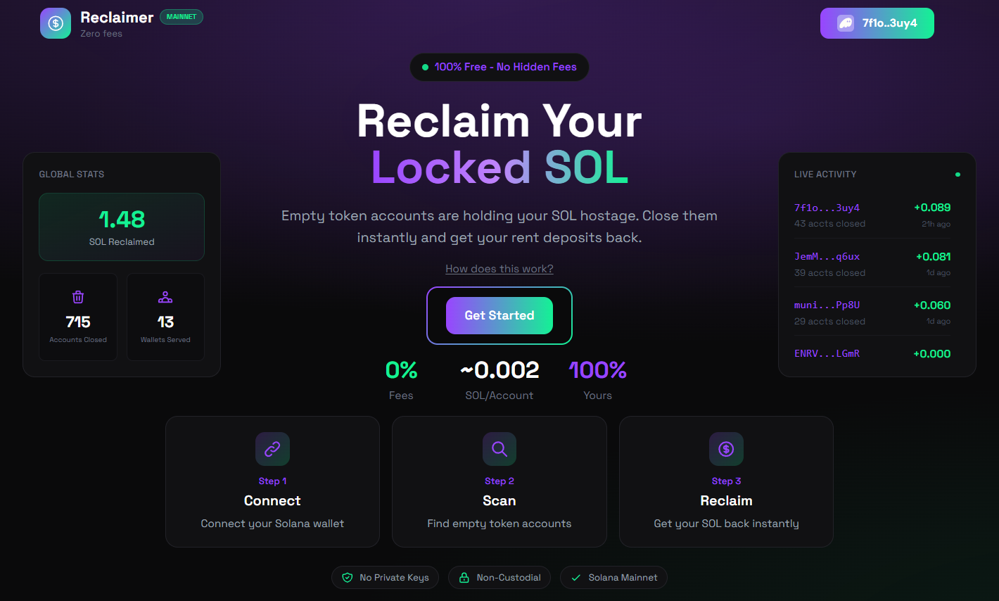
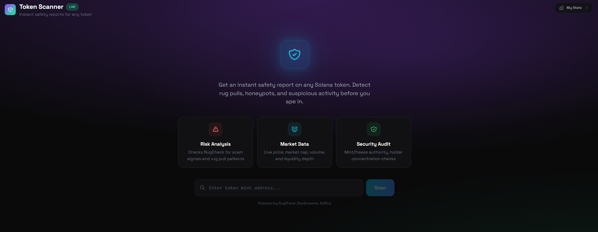
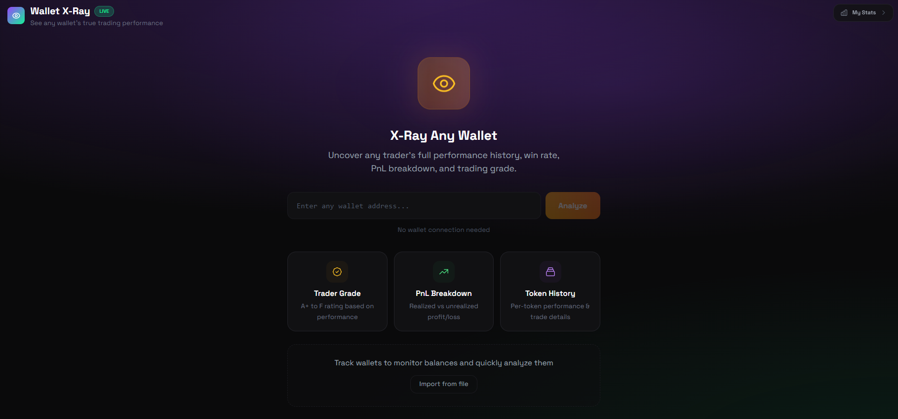
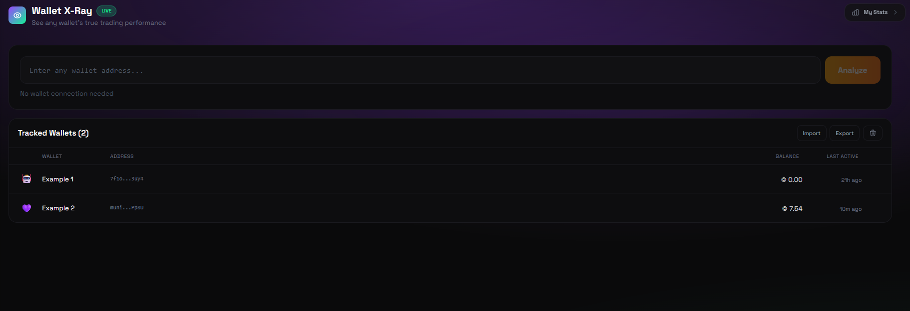

<p align="center">
  
  
  
  
  
</p>

<h1 align="center">SolTools</h1>

<p align="center">
  <b>Free, verifiable Solana tools. No fees, no tracking, no compromise.</b>
</p>

<p align="center">
  
  
  
</p>

<p align="center">
  
</p>

---

## Overview

**SolTools** is a collection of free Solana utilities at [soltools.net](https://soltools.net).

### Tools

| Tool | Route | Description |
|------|-------|-------------|
| **SOL Reclaimer** | `/reclaim` | Close empty token accounts and reclaim locked rent SOL |
| **Burn & Lock** | `/burn-lock` | Burn tokens permanently or lock them via on-chain vesting contracts |
| **Vanity Generator** | `/vanity` | Generate custom Solana wallet addresses with token-based access |
| **Token Scanner** | `/scan` | Instant safety reports — risk scores, holder concentration, LP status, market data |
| **Wallet X-Ray** | `/xray` | Full PnL breakdown, win rate, trader grade, and per-token analysis for any wallet |
| **Hackathon Screener** | `/hackathon` | PumpFun "Build in Public" hackathon tracker with live market data |

More tools coming soon — [request a feature](https://soltools.net) on the home page.

---

## Quick Start

Visit **[soltools.net](https://soltools.net)** to browse all tools.

### SOL Reclaimer

<p align="center">
  
</p>

1. Go to [soltools.net/reclaim](https://soltools.net/reclaim)
2. Connect your Solana wallet
3. Scan for empty token accounts
4. Select accounts to close
5. Reclaim your SOL

### Burn & Lock

#### Burn

<p align="center">
  
</p>

Permanently destroy tokens by sending them to a burn address. Tokens are removed from circulating supply and can never be recovered.

#### Lock

<p align="center">
  
</p>

Lock tokens for a set duration using on-chain vesting contracts. Non-cancellable, non-transferable, fully on-chain.

1. Go to [soltools.net/burn-lock](https://soltools.net/burn-lock)
2. Connect your Solana wallet
3. Select a token and choose **Burn** or **Lock**
4. For burns — choose amount and confirm the permanent destruction
5. For locks — choose amount, duration (1 day to 1 year or custom), and create the lock
6. Share your burn or lock on X with one click

### Vanity Generator

<p align="center">
  
</p>

1. Go to [soltools.net/vanity](https://soltools.net/vanity)
2. Connect your wallet and purchase tokens (1 token = 1 search)
3. Enter a prefix or suffix (1-4 characters)
4. Generate runs entirely in your browser via WASM
5. Download your keypair in Solana CLI format

### Token Scanner

<p align="center">
  
</p>

1. Go to [soltools.net/scan](https://soltools.net/scan)
2. Enter any Solana token address
3. Get an instant safety report with risk score, holder concentration, LP status, and market data
4. View live chart with market cap overlay

### Wallet X-Ray

<p align="center">
  
</p>

1. Go to [soltools.net/xray](https://soltools.net/xray)
2. Enter any wallet address (no connection needed)
3. View trader grade (A+ to F), PnL breakdown, win rate, and per-token trade history
4. Save wallets to track balances and quickly re-analyze them

<p align="center">
  
</p>

### Hackathon Screener

<p align="center">
  
</p>

1. Go to [soltools.net/hackathon](https://soltools.net/hackathon)
2. Browse PumpFun "Build in Public" hackathon tokens with live market data
3. Sort by market cap, volume, price change, and more
4. Search and filter tokens

---

## How the Reclaimer Works

Every token account on Solana holds ~0.00203 SOL in rent. When you swap, trade, or receive airdrops, these accounts accumulate. Even after transferring tokens out, the empty accounts remain, holding your SOL hostage.

```
┌─────────┐    ┌─────────┐    ┌─────────┐    ┌─────────┐    ┌─────────┐
│  SCAN   │───►│ FILTER  │───►│  BUILD  │───►│ EXECUTE │───►│ RECLAIM │
│         │    │         │    │         │    │         │    │         │
│ Find    │    │ Zero    │    │ Batch   │    │ Sign &  │    │ SOL     │
│ Accounts│    │ Balance │    │ Txs     │    │ Send    │    │ Returns │
└─────────┘    └─────────┘    └─────────┘    └─────────┘    └─────────┘
```

### Key Features

| Feature | Description |
|---------|-------------|
| **Zero Fees** | Unlike other tools that take 5-10%, we take nothing |
| **Batch Processing** | Close up to 15 accounts per transaction |
| **Safe** | Only closes accounts with zero balance |
| **Non-Custodial** | Your keys never leave your wallet |
| **Secure** | Transactions are simulated before execution |
| **Live Stats** | Real-time stats and live activity feed |

---

## How Burn & Lock Works

Burn & Lock gives you two ways to permanently handle unwanted or project tokens — burn them forever or lock them for a set period.

**Burn** permanently destroys tokens by removing them from circulating supply. They can never be recovered.

**Lock** creates an on-chain vesting contract. The tokens are locked in a non-cancellable, non-transferable contract that releases them only after the chosen duration expires.

```
┌─────────┐    ┌─────────┐    ┌─────────┐    ┌─────────┐
│ SELECT  │───►│ CHOOSE  │───►│ CONFIRM │───►│  DONE   │
│         │    │         │    │         │    │         │
│ Pick    │    │ Burn or │    │ Sign &  │    │ Share   │
│ Token   │    │ Lock    │    │ Execute │    │ on X    │
└─────────┘    └─────────┘    └─────────┘    └─────────┘
```

### Key Features

| Feature | Description |
|---------|-------------|
| **Zero Fees** | No platform fees on burns or locks |
| **Permanent Burns** | Tokens destroyed from circulating supply forever |
| **On-Chain Locks** | Vesting contracts — non-cancellable, non-transferable |
| **Flexible Duration** | 1 day, 7 days, 30 days, 90 days, 1 year, or custom |
| **All Token Types** | Supports all Solana token standards |
| **Share on X** | One-click share after burn or lock |

---

## How the Vanity Generator Works

The vanity generator creates Solana keypairs with custom prefixes or suffixes. All generation runs client-side in your browser — zero network requests, keys never leave your device.

```
┌─────────┐    ┌─────────┐    ┌─────────┐    ┌─────────┐    ┌─────────┐
│  INPUT  │───►│  SPAWN  │───►│ SEARCH  │───►│  MATCH  │───►│ EXPORT  │
│         │    │         │    │         │    │         │    │         │
│ Prefix  │    │ WASM    │    │ Generate│    │ Base58  │    │ Download│
│ Suffix  │    │ Workers │    │ Keypairs│    │ Check   │    │ Keypair │
└─────────┘    └─────────┘    └─────────┘    └─────────┘    └─────────┘
```

### Key Features

| Feature | Description |
|---------|-------------|
| **Client-Side** | Runs entirely in your browser — works offline after page load |
| **Multi-Threaded** | Uses all available CPU cores for fast generation |
| **Secure** | Private keys are generated locally and never transmitted |
| **Flexible** | Choose prefix, suffix, or both (1-4 characters each) |
| **Token Access** | 1 token per search, purchased with SOL |

---

## Architecture

- **Web** — Static frontend with tools hub and individual tool pages
- **API Worker** — Edge-deployed worker for proxied RPC, analytics, and backend services
- **Core** — Shared library for Solana account scanning and transaction building
- **WASM** — Compiled vanity address generator running in Web Workers

---

## Security

| Aspect | Implementation |
|--------|----------------|
| **No Private Keys on Server** | Client-side signing via wallet adapter |
| **RPC Proxy** | API worker proxies RPC calls — keys never exposed |
| **Transaction Simulation** | All transactions simulated before execution |
| **Non-Custodial** | Your keys never leave your wallet |
| **Client-Side Keygen** | Vanity generator runs entirely in-browser |
| **Rate Limiting** | Per-IP rate limiting on the API worker |

---

## Changelog

### v1.7.0

**Burn & Lock, SOLT Token Page, Feature Requests & Performance**
- New tool: Burn & Lock — burn tokens permanently or lock via on-chain vesting contracts
- Improved burn transaction handling (no more wallet simulation warnings)
- SOLT token page with live chart, top traders, and market data
- SolToolsBot Discord bot promo page
- Feature request form on the home page (submit ideas directly)
- Live active users counter with animated display on the hub
- Share burn/lock results on X with social tracking
- Client-side caching for X-Ray results (faster repeat lookups)
- Improved X-Ray backend caching and edge caching
- Rate limiting on stats and vanity endpoints
- Hub page redesign with promo panels and unique card gradients
- Various UI, mobile, and layout improvements

### v1.6.0

**Token Scanner, Wallet X-Ray & UI Refresh**
- New tool: Token Scanner with safety reports, risk scores, and live charts
- New tool: Wallet X-Ray with PnL breakdown, trader grades, and per-token history
- Saved wallets with import/export and live balance tracking
- Redesigned X-Ray idle screen with dashboard and empty modes
- Compact home page layout with unified visual theme
- Various UI and layout improvements

### v1.5.0

**Hackathon Screener & Mobile Polish**
- Hackathon screener with live market data, sorting, and search
- Full mobile-responsive pass across all pages
- UI polish and bug fixes

### v1.4.0

**Vanity Token System**
- Token-based access for vanity generator
- 6 bundle tiers with volume discounts
- Live price ticker (SOL & BTC)
- Improved mobile layout

### v1.3.0

**SolTools Rebrand & Tools Hub**
- Rebranded from SolReclaimer to SolTools
- New tools hub homepage with tool cards
- Vanity address generator
- Collapsible sidebar and bottom nav

### v1.2.0

**Mobile Support & Price Ticker**
- Full mobile-responsive redesign
- Batch transaction improvements

### v1.1.0

**Live Dashboard & Backend**
- Live activity feed
- Edge-deployed API worker

### v1.0.0

**Initial Release**
- Zero-fee rent reclaiming with batch processing
- Solana wallet adapter integration
- Transaction simulation

---

## License

**Proprietary** - All rights reserved. See [LICENSE](LICENSE) for details.

---

<p align="center">
  <b>Built by Dequavious</b>
</p>
