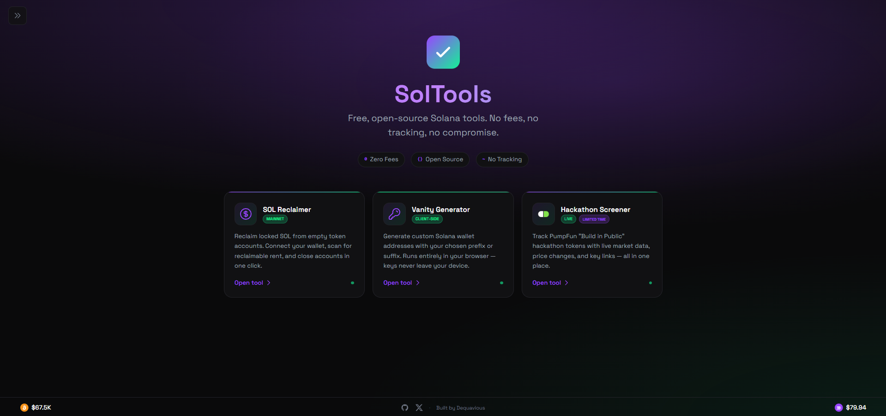
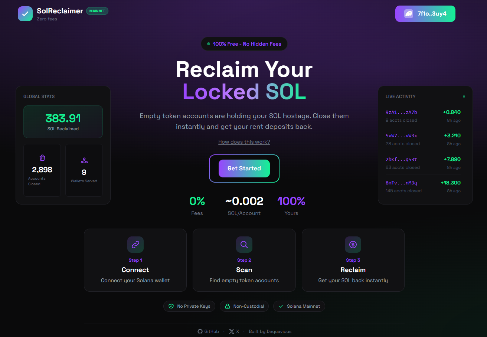
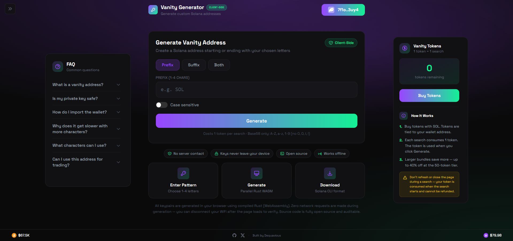
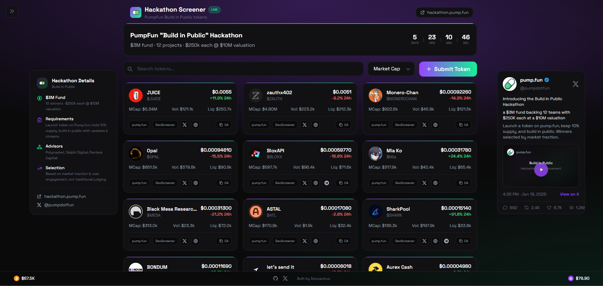

<p align="center">
  
  
  
  
  
</p>

<h1 align="center">SolTools</h1>

<p align="center">
  <b>Free, open-source Solana tools. No fees, no tracking, no compromise.</b>
</p>

<p align="center">
  
  
  
</p>

<!-- Main hub preview -->
<p align="center">
  
</p>

---

## Overview

**SolTools** is a collection of free Solana utilities at [soltools.net](https://soltools.net).

### Tools

| Tool | Route | Description |
|------|-------|-------------|
| **SOL Reclaimer** | `/reclaim` | Close empty token accounts and reclaim locked rent SOL |
| **Vanity Generator** | `/vanity` | Generate custom Solana wallet addresses with token-based access |
| **Hackathon** | `/hackathon` | Community hackathon token submissions and voting |

More tools coming soon.

---

## Quick Start

Visit **[soltools.net](https://soltools.net)** to browse all tools.

### SOL Reclaimer

<p align="center">
  
</p>

1. Go to [soltools.net/reclaim](https://soltools.net/reclaim)
2. Connect your Solana wallet
3. Scan for empty token accounts
4. Select accounts to close
5. Reclaim your SOL

### Vanity Generator

<p align="center">
  
</p>

1. Go to [soltools.net/vanity](https://soltools.net/vanity)
2. Connect your wallet and purchase tokens (1 token = 1 search)
3. Enter a prefix or suffix
4. Generate runs entirely in your browser via WASM
5. Export your keypair

### Hackathon Screener

<p align="center">
  
</p>

1. Go to [soltools.net/hackathon](https://soltools.net/hackathon)
2. Browse community-submitted hackathon tokens
3. View token details, social links, and contract addresses
4. Vote on your favorite projects

---

## How the Reclaimer Works

Every token account on Solana holds ~0.00203 SOL in rent. When you swap, trade, or receive airdrops, these accounts accumulate. Even after transferring tokens out, the empty accounts remain, holding your SOL hostage.

```
┌─────────┐    ┌─────────┐    ┌─────────┐    ┌─────────┐    ┌─────────┐
│  SCAN   │───►│ FILTER  │───►│  BUILD  │───►│ EXECUTE │───►│ RECLAIM │
│         │    │         │    │         │    │         │    │         │
│ Find    │    │ Zero    │    │ Batch   │    │ Sign &  │    │ SOL     │
│ Accounts│    │ Balance │    │ Txs     │    │ Send    │    │ Returns │
└─────────┘    └─────────┘    └─────────┘    └─────────┘    └─────────┘
```

### Key Features

| Feature | Description |
|---------|-------------|
| **Zero Fees** | Unlike other tools that take 5-10%, we take nothing |
| **Batch Processing** | Close up to 15 accounts per transaction using Address Lookup Tables |
| **Safe** | Only closes accounts with zero balance |
| **Non-Custodial** | Your keys never leave your wallet |
| **Secure** | Transactions are simulated before execution |
| **Live Stats** | Real-time global stats and live activity feed |

---

## Architecture

- **Web** — Next.js 14 static export with tools hub at `/`, individual tools at `/reclaim`, `/vanity`, `/hackathon`
- **API Worker** — Cloudflare Worker with KV storage for stats, vanity tokens, analytics, proxied RPC with method allowlist
- **Core** — Shared TypeScript library for Solana account scanning and transaction building with ALT support
- **WASM** — Rust-compiled vanity address generator running in Web Workers

---

## Security

| Aspect | Implementation |
|--------|----------------|
| **No Private Keys on Server** | Web app uses wallet adapter (client-side signing) |
| **RPC Proxy** | API worker proxies RPC calls with method allowlist — API key never exposed |
| **Transaction Simulation** | All transactions simulated before execution |
| **Non-Custodial** | Your keys never leave your wallet |
| **Client-Side Keygen** | Vanity generator runs entirely in-browser via WASM |
| **Rate Limiting** | 120 req/min per IP on the API worker |
| **On-Chain Verification** | Vanity token purchases verified on-chain before crediting |

---

## Changelog

### v1.4.0

**Vanity Token System & Hackathon**
- Token-based access for vanity generator (purchase with SOL, on-chain verified)
- 6 bundle tiers with volume discounts up to 40%
- Unique token strings in KV for tamper-proof balance tracking
- Hackathon page for community token submissions
- Admin dashboard with TOTP, charts, analytics
- Live price ticker (SOL & BTC)
- Improved mobile layout and touch feedback

### v1.3.0

**SolTools Rebrand & Tools Hub**
- Rebranded from SolReclaimer to SolTools
- New tools hub homepage at `/` with tool cards
- Reclaimer moved to `/reclaim`
- Sidebar and bottom nav for tool switching
- Domain changed to soltools.net

### v1.2.0

**Mobile Support & Price Ticker**
- Full mobile-responsive redesign
- Mobile wallet picker with deep links
- Address Lookup Tables for larger batch transactions
- Touch feedback and UI polish

### v1.1.0

**Live Dashboard & Backend**
- Global Stats panel with live SOL reclaimed, accounts closed, and wallets served
- Live Activity feed showing recent reclaims across all users
- Edge-deployed API worker with KV-backed stats and RPC proxy
- Per-IP rate limiting (120 req/min)

### v1.0.0

**Initial Release**
- Zero-fee rent reclaiming with batch processing
- Solana wallet adapter integration with non-custodial signing
- Transaction simulation before execution
- Responsive UI with gradient design system

---

## License

**Proprietary** - All rights reserved. See [LICENSE](LICENSE) for details.

---

<p align="center">
  <b>Built by Dequavious</b>
</p>
